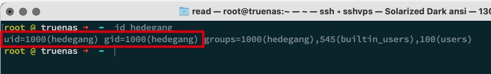
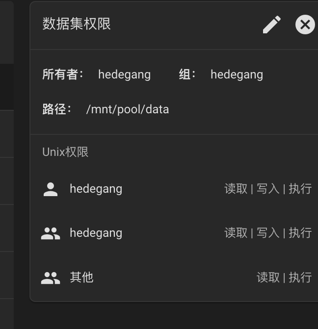
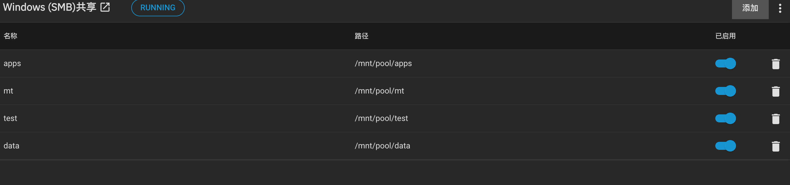
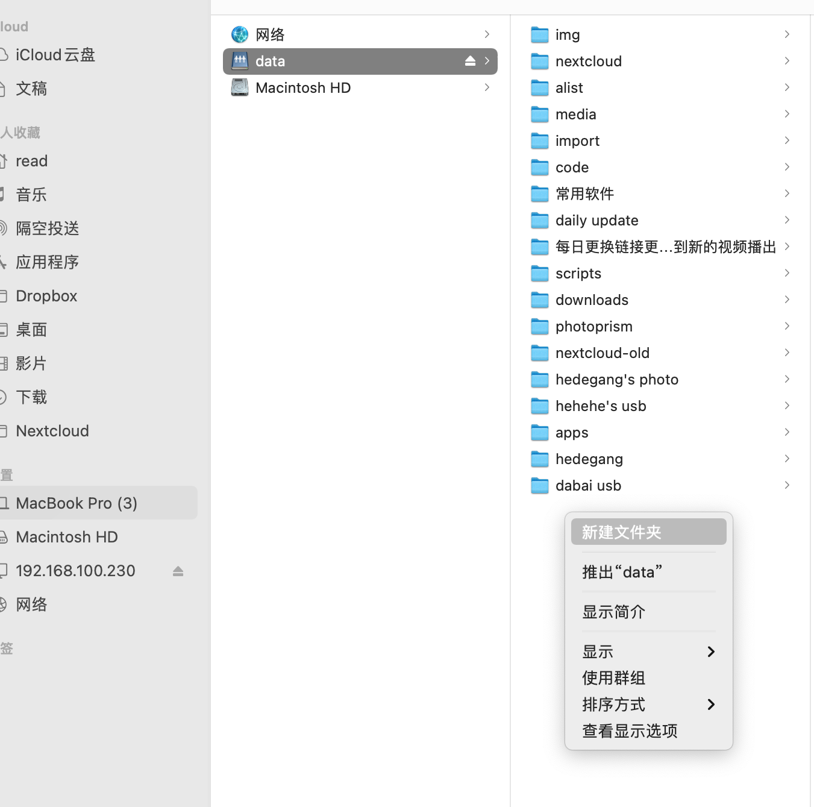
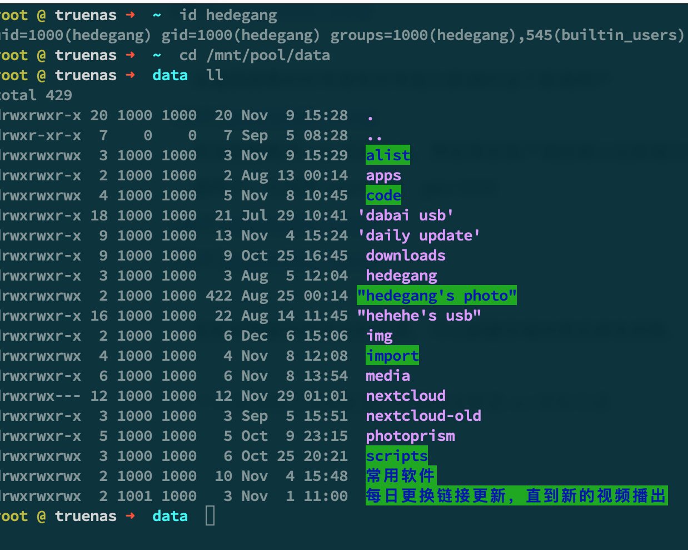

# truenas scale 个人应用库

## APP List

> 应用部署请参考各个应用下的readme.md

- **jellyfin** 使用 [nyanmisaka/jellyfin](https://hub.docker.com/r/nyanmisaka/jellyfin) docker 镜像，增加配置 `/etc/hosts`
- **nastools** 增加配置 `/etc/hosts`，相关[教程](https://www.bilibili.com/video/BV1884y147Ny/?share_source=copy_web&vd_source=5158532412bafce97b73614e5a9f994c)，**由于 truenas 系统原因，23.10版本无法运行**
- **vlmcsd** 运行在 docker 里的 kms 激活服务器
- **ChineseSubFinder** 自动下载字幕
- **MT Photos** 照片备份 APP,收费软件，[官方网站](https://mtmt.tech/)
- **xunlei** 迅雷 docker 版本，邀请码：迅雷牛通
- **moviepilot** 追剧，媒体整理
- **cookiecloud** 同步 cookie
- **hlink** 硬链接工具
- **qbittorrent** bt 下载工具，支持 host 网络模式
- **transmission** bt 下载工具，支持 host 网络模式

## how to 增加第三方应用库

  

- gitee 源
  `https://gitee.com/qwerty0007/xchart.git`

由于国内连接 github 经常出问题，不提供 github 的源了

~~https://github.com/qwerty00007/xchart.git~~

## 使用集群内的内部域名，应用内互访

- 查看所有 pod 的信息，获得应用的 NAMESPACE `k3s kubectl get pod -A` 

- 查看指定命名空间的 svc 信息，获得应用的 SERVICE-NAME `k3s kubectl get svc -n $NAMESPACE`

- 集群内的域名 `$SERVICE-NAME.$NAMESPACE.svc.cluster.local`

## 简单的权限设置避免部署应用时出现权限问题

- 在 truenas scale 新建普通用户，uid 一般是 1000，可以命令行验证
  
  
 
- 设置数据集的所有者和所有组为新建的这个普通用户
  
  
- 将该数据集用 smb 共享出去，然后再在客户端挂载以后新建文件夹，这样就能保证文件夹的权限为该普通用户，也就是 uid=1000， gid=1000
  
  
  
  
- 其他有需要快照备份的应用，可以新建数据集然后修改权限。

> 个人家用建议这样配置，不需要去配置 acl 简单方便

## 请我喝奶茶
- 微信

  

- 支付宝

  